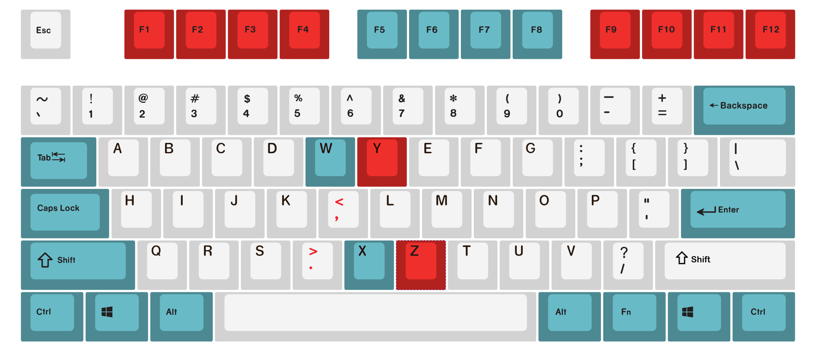
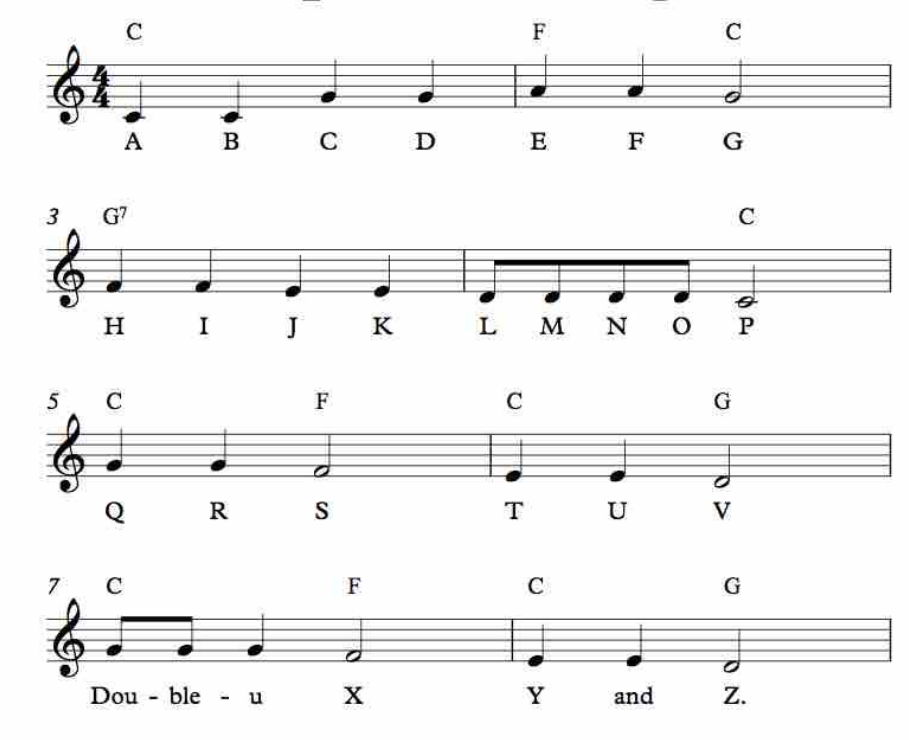
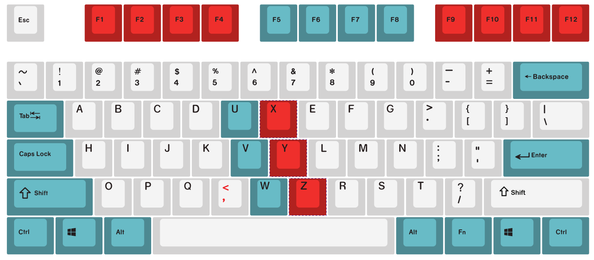
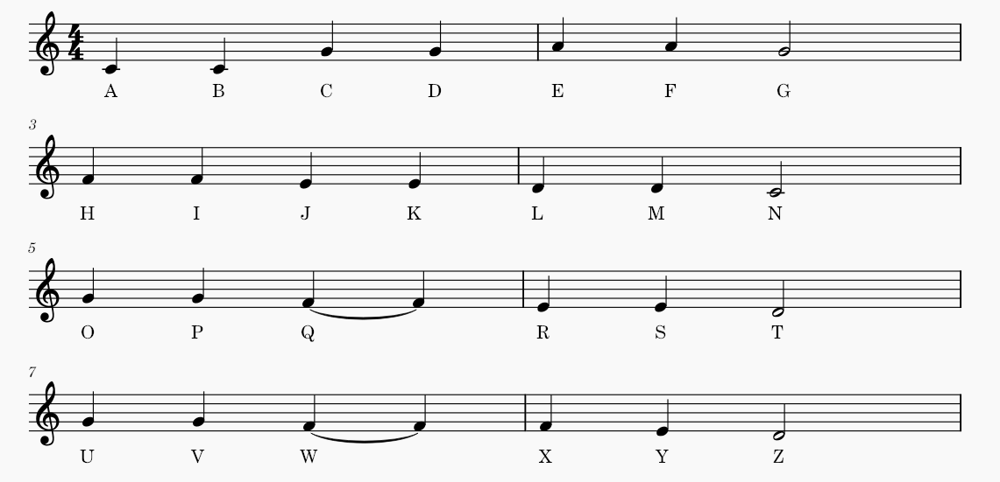

# ABC song based keyboard layout
The most popular keyboard layout is qwerty. It has a history of about a century. For beginners, it is hard to find letters when typing. 
  
I invented a new keyboard layout.
The main goals of the layout are as follows

*  No need to learn. Users will find the letter keys at the first sight.
*  No need to memorize. Users do not need to memorize the layout.
*  users can gradually get familiar with layout.
*  users can learn the best practice of touch typing automatically.

## Layout 1

This layout is based on the popular ABC song in America. 

## Layout 2

This layout is based on the popular ABC song in China. 

  

## Description
A row of the keyboard corresponds to a row of the song. A row of the keyboard was separated into two parts by two columns which correspond to the two sections of the song. 

All goals are met. When users get the keyboard, they will naturally put their hands on the two sides of the middle colored columns which is best practice for touch typing. Users will find the letter keys fast in their brains instead of eyes.

